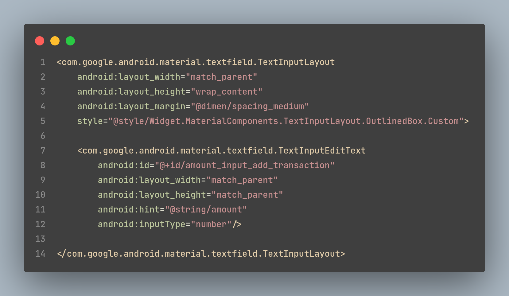
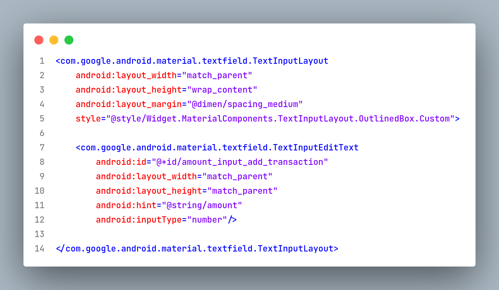

# Change Log

## [0.1.1 - 05-27-2023]
#### Added

- Default Notepadd++ dark

## [0.1.1 - 04-09-2023]
#### Changed

- Changed Editor Colors

## [0.1.0 - 04-08-2023]
#### Changed, Added

- Changed Editor Colors
- Added support for Python, Markdown, Assembly

## [0.0.1 - 11-20-2022]
#### Added

- Initial Release: Default Notepad++ light

