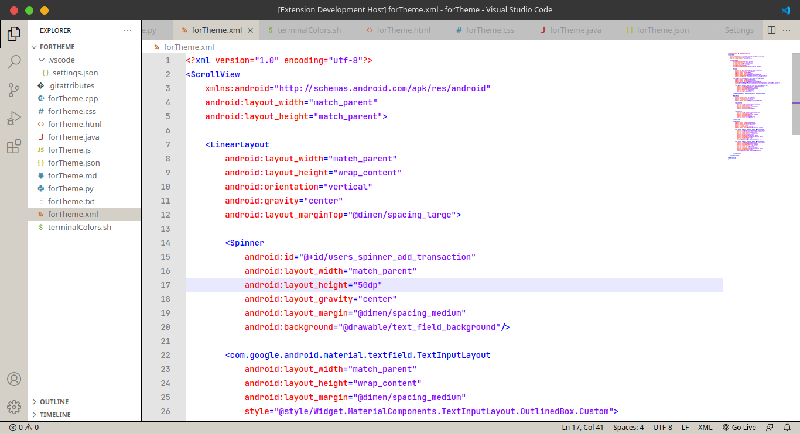

# Notepad++ color theme README

Default Notepad++ color theme for VS Code.

## Supported Languages
* HTML - CSS - JS
* C++
* Java - XML
* Python

## Applying theme

### To apply theme:

* Ctrl+Shift+P -> Preferences: Color Theme -> Default (Notepad++)

## Preview

**Enjoy!**
