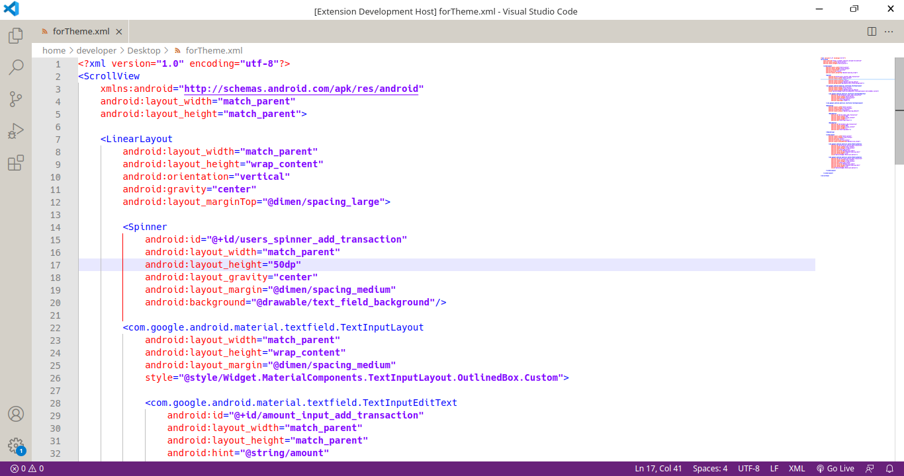

# Notepad++ color theme README

Default Notepad++ color theme for VS Code.

## Applying theme

### To apply theme:

* Ctrl+Shift+P -> Preferences: Color Theme -> Notepad++ default

## Preview

**Enjoy!**
