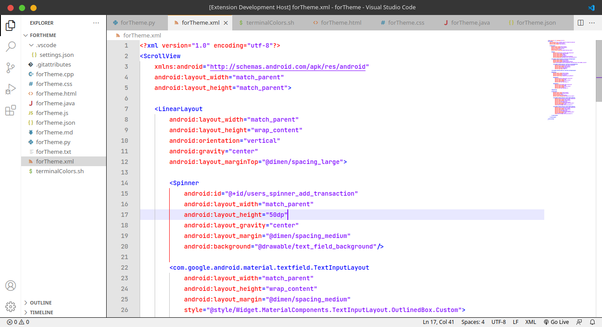
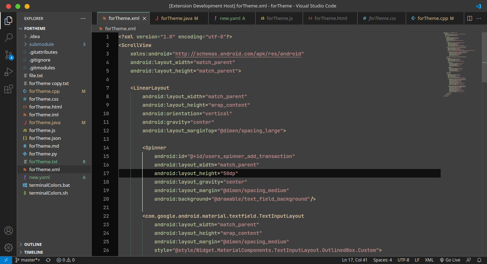

# Notepad++ color themes README

Default Notepad++ color themes for VS Code.

## Previews

* Default (Notepad++ light)

* Default (Notepad++ dark)

## Supported Languages
* HTML - CSS - JS
* C++
* Java - XML
* Python

## Applying theme

### To apply theme:

* Ctrl+Shift+P -> Preferences: Color Theme -> Default (Notepad++ light)
* Ctrl+Shift+P -> Preferences: Color Theme -> Default (Notepad++ dark)
---

**Enjoy!**
